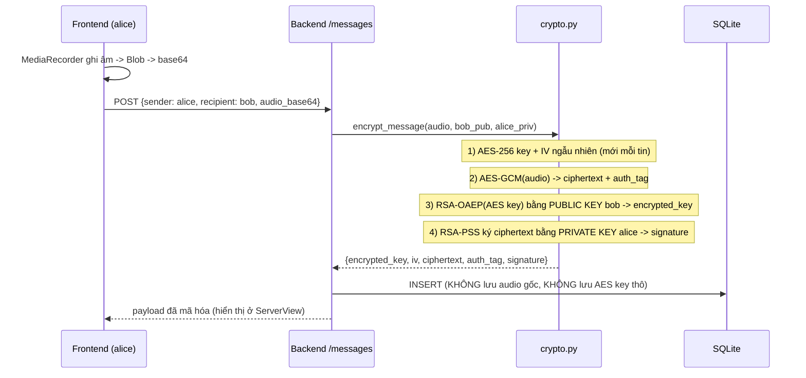
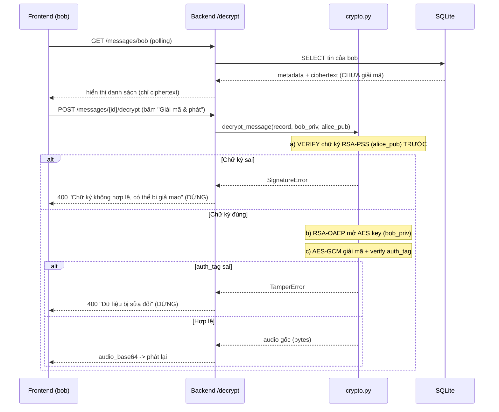

# Kiến trúc & Luồng mã hóa

## 1. Tổng quan hệ thống

```
┌─────────────────────┐         REST (polling 3s)        ┌──────────────────────┐
│   Frontend (React)  │  ───────────────────────────────▶ │   Backend (FastAPI)  │
│                     │                                    │                      │
│  - MediaRecorder    │   POST /messages (audio base64)    │  crypto.py           │
│    (ghi âm)         │ ─────────────────────────────────▶ │   AES-256-GCM        │
│  - ServerView       │                                    │   RSA-OAEP / RSA-PSS │
│    (hiện ciphertext)│   GET  /messages/{user}            │                      │
│  - phát audio       │ ◀───────────────────────────────── │  db.py  ──▶ SQLite   │
└─────────────────────┘   POST /messages/{id}/decrypt      │  keystore.py ──▶ PEM │
                                                            └──────────────────────┘
```

Crypto chạy **ở backend**. Đây là **encryption at rest**, không phải E2E
(xem "Hạn chế" trong README).

---

## 2. Luồng GỬI tin nhắn (mã hóa + ký)



---

## 3. Luồng NHẬN & GIẢI MÃ (fail-closed)



**Nguyên tắc fail-closed:** verify chữ ký + verify GCM tag PHẢI xảy ra **trước**
khi trả plaintext. Bất kỳ bước nào fail -> dừng, không lộ audio.

---

## 4. Vì sao dùng hybrid AES + RSA?

- **AES-256-GCM**: mã hóa đối xứng, nhanh, xử lý được audio lớn; GCM cho luôn
  auth tag để phát hiện sửa đổi.
- **RSA-OAEP**: RSA chỉ mã hóa được dữ liệu nhỏ, nên ta chỉ dùng RSA để **bọc
  khóa AES 32 byte** (không mã hóa trực tiếp audio). Chỉ người nhận có private
  key mới mở được khóa AES.
- **RSA-PSS**: chữ ký số chứng minh **nguồn gốc** (chỉ người gửi có private key
  ký được) và **toàn vẹn** (ký trên ciphertext).

---

## 5. Dữ liệu lưu trong DB (bảng `messages`)

| Cột | Nội dung | Ghi chú |
|-----|----------|---------|
| `encrypted_key` | RSA-OAEP(AES key), base64 | mỗi tin một key khác nhau |
| `iv` | nonce GCM 12 byte, base64 | mỗi tin một IV ngẫu nhiên |
| `ciphertext` | AES-GCM(audio), base64 | **không đọc/nghe được** |
| `auth_tag` | GCM tag 16 byte, base64 | phát hiện sửa đổi |
| `signature` | RSA-PSS trên ciphertext, base64 | xác minh nguồn gốc |

Không có cột nào chứa audio gốc hay AES key thô → **encryption at rest**.
